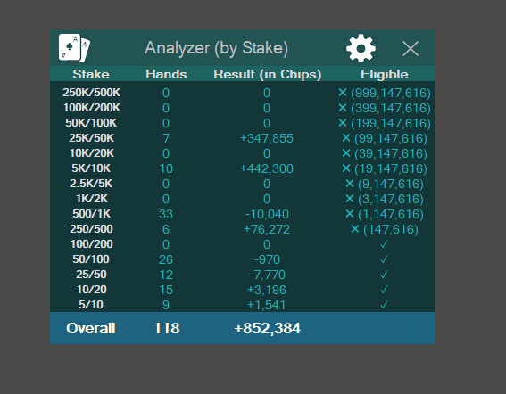

On the left you can see the poker software. On the right, you can see a User interface for a program that I have developed. This program logins into the poker software and keeps it open when it is closed. The program communicates with the poker software through simulation of keyboard and mouse clicks by sending PostMessage notifications into the Window handle. 

